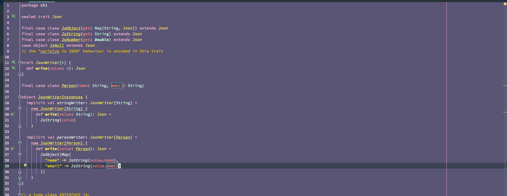

# fairyfloss-intelliJ
port of [Sailorhg's](https://github.com/sailorhg) atom fairyfloss theme to intelliJ (specifically Scala)

* [Fairyfloss theme for atom](https://github.com/sailorhg/fairyfloss)

This is built on top of the [Nord Theme](https://github.com/arcticicestudio/nord-jetbrains-editor), so there is a lot of blue cruft in other languages besides Scala as I have not gone through to change override settings.  It's not exactly 1-to-1 as some language highlight features are different and intelliJ has some more advanced options.  This is very early days and I'm not set on colors for certain items that don't exist in Atom. 

**wip** this is an **early version** 

